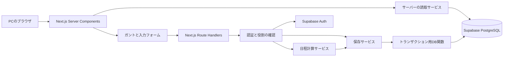
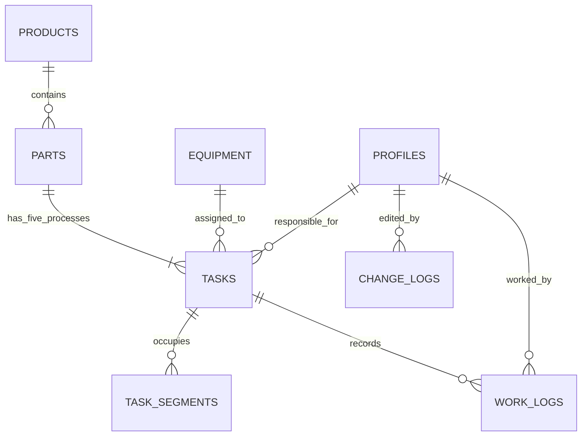

# 生産管理システム システム設計書

版: 1.0（初期実装用設計）
作成日: 2026-09-30
フェーズ: design
根拠: docs/要件定義書.md 第0.1版。2026-09-30の「次に進んでください」で承認済み。
要件定義書は前工程の成果物として変更しない。追加回答は本設計書と設計判断記録に反映する。

## 1. 設計の状態

確定要件に基づくシステム構成・画面・DB・APIの設計案。
優先順位は設備ごとの連番、所要時間は30分刻み・時刻は1分単位・目盛りは30分刻み、固定指定の予定は自動調整から除外することを確認済み。
メールアドレス・パスワードでのログイン、製品名・取引先・パーツ名・数量・図番・納期・備考を維持することは確定。実績に合わせて残りの予定と後工程を空き時間へ組み直すことは確定。製品には製品名・取引先・納期・備考、パーツにはパーツ名・数量・図番。製品名・納期・パーツ名・数量は必須、取引先・図番・備考は任意。実績時刻の重複は警告後保存可能、修正理由は任意、当時の休憩設定を保持する。
確認済みの画面・日程計算・入力条件の設計を確定し、初期実装に進む。Supabase実接続と運用設定は未設定のため、接続なしのデモ実装と実運用の完了を区別する。

## 2. システム構成



- Next.js 16 App Router、TypeScript strict、Tailwind CSS、Supabaseを使用。
- 初期表示・データ読取はServer Components、ガントの操作・プレビュー・フォームはClient Components。
- クライアントは業務テーブルを直接更新せず、Route Handlers経由で保存する。
- 日程計算はDBや画面から独立した純粋関数とし、境界条件を単体テストできるようにする。
- Supabase接続先未設定時は、実データ画面を動いているように見せず設定不足を案内する。
- 見た目の確認用データを使う場合はデモと明示し、実運用の保存とは区別する。

## 3. 画面・コンポーネント

### 3.1 生産計画画面 `/planning`

- 上部: 表示開始日、期間、今日へ移動、製品・設備・担当者の絞り込み。
- 管理者向け操作: 製品・パーツ登録、予定作成、飛び込み挿入、自動調整。
- 左側: 製品、パーツ、工程、設備、担当者、優先順位、状態。製品・パーツ単位で折り畳む。
- 右側: 日付と時間の見出し、工程別の色付きバー、開始・終了時刻、休日・休憩の背景。
- 一覧と時間軸は同じ行データと行高を共有する。左列・上部見出しは固定し、縦スクロールは共通にする。
- 選択したタスクの詳細は右側パネル。予定と実績を別タブで扱う。
- 関連パーツの前後工程を選択時に強調する。バーの文字だけに情報を依存せず詳細を開ける。
- 重複と納期超過は色に加えてアイコン・テキストで表示する。
- 管理者のみ予定を編集。担当者も全タスクの実績を入力・修正できる。
- 予定バーと実績の表示、初期表示期間、ドラッグ操作は確認後に確定。

### 3.2 補助画面

| 画面 | 内容 | 権限 |
| --- | --- | --- |
| `/login` | 個人ごとのメールアドレス・パスワードでログイン | 未ログイン |
| `/products` | 製品・パーツの一覧と登録 | 閲覧は全員、登録・予定項目変更は管理者 |
| `/settings/equipment` | 工程ごとの設備一覧、設備の有効・無効 | 管理者 |
| `/settings/calendar` | 会社カレンダー、勤務と休憩 | 管理者 |

設備・担当者の実際の名称は初期データとして別途登録する。削除で過去の予定・実績を失わないよう、参照済みマスターは無効化する。

### 3.3 コンポーネント分割

PlanningToolbar、PlanningGrid、FrozenTaskColumns、TimelineHeader、TimelineRow、TaskBar、TaskDetailPanel、ProductPartForm、TaskPlanForm、WorkLogForm、PriorityEditor、SchedulePreview、CalendarEditor。
画面ごとの読取サービスと認証チェックを共通化する。

## 4. データベース設計

共通: 内部IDはUUID。日時はtimestamptz、日付はdate、時間は整数分。表示と会社カレンダーの解釈はAsia/Tokyo。
更新対象にversion、created_at、updated_atを持たせる。参照済みデータは原則として物理削除しない。

| テーブル | 主な列 | 役割・制約 |
| --- | --- | --- |
| profiles | user_id PK→auth.users、display_name、role、is_active | roleはadmin/operator。本人による昇格は禁止 |
| products | id、name、customer_name、due_date、notes、is_archived、version | 製品名で管理。同名の別案件を内部IDで区別 |
| parts | id、product_id、name、quantity、drawing_number、notes、version | 製品に所属。パーツ名・数量は必須、図番は任意。納期は製品から継承 |
| equipment | id、name、process_code、is_active、version | 工程は固定5種類。設備とタスクの工程が一致すること |
| company_settings | id、timezone、work_start、work_end、version | 日本時間、8:50〜17:40。変更権限は管理者 |
| company_breaks | id、start_time、end_time、version | 12:00〜12:50、15:00〜15:10。重複区間を許可しない |
| calendar_days | date PK、is_working、label、version | カレンダー未設定日は推測せず、予定計算前に設定を求める |
| tasks | id、part_id、process_code、equipment_id、assignee_id、duration_minutes、requested_start、planned_start、planned_end、priority_order、allow_break_run、allow_overnight、is_fixed、status、actual_start、actual_end、version | パーツ×工程で一意。5工程を一括作成。設備ごとの未着手タスクに連番。固定指定は自動調整対象外 |
| task_segments | id、task_id、start_at、end_at | 勤務・休憩・休日を除いた設備占有区間。予定バーの外枠とは分離 |
| work_logs | id、task_id、worker_id、start_at、end_at、calculated_minutes、override_minutes、override_reason、calendar_snapshot、created_by、updated_by、version | 日またぎを許容し、日本時間の日付に分割して集計。過去の休憩設定を保持する案 |
| change_logs | id、actor_id、entity_type、entity_id、before_data、after_data、created_at | 誰の実績かと誰が編集したかを別に記録。ユーザーから直接変更不可 |
| schedule_state | id、revision、needs_recalculation | 全体の計算入力の版。予定・設備・カレンダー・作業状態の変更で更新 |
| schedule_drafts | id、actor_id、base_revision、operation、source_task_id、source_work_log_id、proposed_changes、warnings、expires_at、committed_at | 計算プレビュー。確定前は業務予定を変更しない |

### 4.1 リレーション



### 4.2 整合性・権限

- 全業務テーブルにRLSを設定し、有効な個人アカウントのみ読取可能にする。
- 役割はDBのprofilesから確認。リクエストで送られたroleは信用しない。
- 業務更新は用途別DB関数に限定し、直接テーブル更新で認証・監査・版管理を迂回できないようにする。
- 更新関数は実行者・役割・入力をDBでも確認する。SECURITY DEFINER使用時はsearch_pathを固定し、参照をスキーマ修飾し、不要なEXECUTE権限を剥奪する。
- 管理者は予定・製品・設備・カレンダーを変更可能。operatorは実績と作業状態の変更のみ可能。
- 完了・作業中の予定は自動調整の更新対象から除外する。手動修正の範囲は別途確認する。
- equipment_id、assignee_idは外部キー。activeでない設備・担当者を新しい予定に割り当てない。
- 開始＜終了、所要時間＞0、実績修正時間≧0を検証する。
- 設備ごとの未着手タスクに1からの一意な連番を設定し、挿入・移動・設備変更・作業開始で振り直す。順位入替は同一トランザクションで行う。固定予定も未着手キューに残すが日時を動かさない。
- 重複保存を許可するため、設備区間の一律排他制約は設けない。重複する組合せと時間区間の明示確認を要求する。
- 自動計算では予定の外枠ではなくtask_segmentsで設備の重複を判定する。
- インデックス: tasks(equipment_id, planned_start)、tasks(part_id, process_code)、task_segments(task_id)、work_logs(task_id, start_at)、calendar_days(date)。

## 5. 日程計算

### 5.1 入力とカレンダー

入力は対象タスク、先行工程、設備の予定、優先順位、所要時間、計算開始日時、会社カレンダー、休憩、夜間・休憩中稼働の可否、固定予定。
夜間対象はマシニング・自動研磨・ワイヤーのみ。型組・トライに夜間設定は許可しない。
通常タスクは勤務時間から休憩を除いた区間を使用する。休憩中稼働を指定した設備タスクは休憩も使用する。
夜間指定タスクは開始可能時刻から連続稼働し、休日も使用する。
所要時間は30分刻み（正の30の倍数）、開始・終了時刻は1分単位、ガント目盛りは30分刻み。8:50・12:50・15:10・17:40も丸めず使用する。

### 5.2 計算手順

1. 計算時点の全体revisionを取得し、状態とカレンダーを読み込む。
2. 作業中・完了済み・固定予定を動かさない区間として配置する。固定予定は管理者が固定を解除しない限り維持する。
3. 対象タスクの順位を更新し、関連する未着手の後工程と設備の後続タスクを計算対象へ追加する。
4. パーツ内の工程順と設備内の順位順を依存関係として組み立てる。
5. 依存関係が循環する場合は、該当するタスクを表示して順位変更を求める。無限計算や黙った順位無視は行わない。
6. 先行工程の終了とタスクの開始可能時刻より後で、設備・カレンダーが許す区間を見つける。
7. 所要時間を稼働可能区間に配分し、設備占有区間と開始・終了予定を生成する。
8. 次の工程へ終了時刻を伝播し、他の設備の競合も含めて計算する。
9. 変更前後、設備重複、納期超過をプレビューへ返す。
10. カレンダー不足・設備未指定・無効な所要時間・計算範囲超過は、該当タスクと理由を返す。

作業中タスクが終了予定を超過している場合、後続を完了済みとみなして計算しない。管理者へ終了見込みの確認を求め、実績を改変せず解消する設計案。

### 5.3 プレビューと確定

- 操作中は業務予定を保存しない。計算結果をdraftとして保持する。
- 管理者が変更と警告を確認し、draft_id、base_revision、確認した重複を送る。
- 確定時にschedule_stateをロックしてrevision、実行者の管理者権限、draftの起点・有効期限、タスク状態を再確認する。実績起点のdraftは別の担当者が生成していても管理者が確認・確定できる。
- 最新revisionが異なる場合は409を返し、再計算を求める。
- 順位・タスク予定・占有区間・変更履歴・revisionを1トランザクションで更新する。
- 日時・所要時間・前後工程・警告確認をDB側でも検証する。未検証のクライアント計算結果をそのまま書き込まない。
- 再送はdraft_idで識別し、同じ確定操作の二重適用を避ける。
- 実績保存やカレンダー・設備変更も同じrevision管理に参加し、プレビュー中の更新を検知する。

### 5.4 実績に連動した再計算（確認済み）

- 実績保存後、その実績に合わせて残りの未着手タスクと後工程を自動計算する。
- 完了済み先行工程の依存関係は実際の完了時刻を基準にする。早く終わった場合も遅く終わった場合も、設備の順位・空き時間・固定予定を守って計算する。
- 実績の作業時刻、作業中・完了済み・固定タスクの予定は自動で動かさない。
- 作業日誌の終了時刻を工程の完了とみなさない。工程の完了は明示した状態と実際の完了時刻で判定する。
- 担当者の実績作業時間と設備稼働時間は異なるため、実績の作業時間を工程の所要時間から機械的に減算しない。未着手の後工程は設定された所要時間を使用する。
- 実績保存は直ちに反映し、予定再計算の結果はdraftにする。管理者が日程・納期超過を確認して確定するまで、保存済み予定は維持する。
- 実績保存ではneeds_recalculationを立てる。計算に失敗しても実績を破棄せず、予定未調整として理由を表示し、管理者が条件を修正して再計算する。
- operatorは実績起点の再計算のみ要求でき、順位・設備・固定設定の変更はできない。
- 実績保存時の同じトランザクションで起点と版を記録し、実績起点のpreviewは入力された任意の予定変更を受け付けない。
- 最新版のdraft確定時にneeds_recalculationを解消する。再計算中に追加更新が入った場合は、再計算を求める。

## 6. 実績時間の計算

- 日本時間で作業区間を日付ごとに分割する。
- 各日、入力区間と休憩区間が重なった分だけ控除する。区間は[開始, 終了)で扱う。
- 11:30〜13:20なら110分から昼休み50分を除き60分。
- 休憩時間だけの入力は0分。終了≦開始などの不正入力は保存しない。
- 設備の無人稼働を担当者の作業として自動生成しない。担当者が実際に入力した作業区間を集計する案。
- 計算値と修正値を別々に保持し、修正時も元の開始・終了と計算値を失わない。
- worker_idは作業者、created_by/updated_byは入力・修正者。
- 修正理由は任意。休憩設定のスナップショットを保持し、過去の時間は設定変更で変えない。同一作業者の実績区間重複は警告後に保存可能。
- 状態変更と実績変更は専用の保存関数で実行し、operatorが予定日時を変更できないようにする。

## 7. API一覧

更新APIは認証・役割確認、入力検証、try/catch、用途別DB関数呼出しを共通化する。
Cookie認証の更新要求はOriginを検証する。認証済みのレスポンスを共有キャッシュへ保存しない。

| Method / Path | 入力・用途 | 権限 |
| --- | --- | --- |
| GET `/api/planning` | from、to、productId、equipmentId、assigneeId。対象範囲を横断するタスクも返す | 全員 |
| GET `/api/products` | 製品・パーツ一覧、ページング | 全員 |
| POST `/api/products` | 製品項目 | 管理者 |
| PATCH `/api/products/[id]` | 変更項目、expectedVersion | 管理者 |
| POST `/api/products/[id]/parts` | パーツ項目、5工程の初期データ | 管理者 |
| PATCH `/api/parts/[id]` | 変更項目、expectedVersion | 管理者 |
| GET `/api/equipment` | 工程別の設備 | 全員 |
| POST・PATCH `/api/equipment[/id]` | 設備登録・更新、expectedVersion | 管理者 |
| GET `/api/profiles` | 担当者名と有効状態 | 全員 |
| GET `/api/calendar` | from、to、勤務・休憩・稼働日 | 全員 |
| PUT `/api/calendar` | 日別設定、expectedRevision | 管理者 |
| PATCH `/api/company-settings` | 勤務・休憩、expectedRevision | 管理者 |
| POST /api/schedule/preview | operation=create/reorder/insert/manual、対象、順位、開始条件、expectedRevision | 管理者 |
| POST /api/schedule/recalculate-from-actual | sourceTaskId、sourceWorkLogId、expectedRevision。保存済み実績から計算し、予定変更の入力は受け付けない | 全員 |
| GET /api/schedule/drafts | 最新版の再計算案と調整待ち状態 | 管理者 |
| POST `/api/schedule/commit` | draftId、expectedRevision、acknowledgedConflicts | 管理者 |
| GET `/api/tasks/[id]` | 詳細・日別実績 | 全員 |
| PATCH `/api/tasks/[id]/status` | status、実際の開始・終了、expectedVersion | 全員 |
| POST `/api/tasks/[id]/work-logs` | workerId、startAt、endAt、overrideMinutes、reason | 全員 |
| PATCH `/api/work-logs/[id]` | 実績変更、expectedVersion | 全員 |

レスポンスは成功時{data, revision}、失敗時{error:{code,message,fieldErrors}}。
400=入力不正、401=未ログイン、403=権限不足、404=対象なし、409=版競合、422=日程を計算できない、500=予期しない失敗。
詳細なDBエラーや秘密情報は利用者へ返さない。
予定入力にequipmentId、assigneeId、durationMinutes、requestedStart、priorityOrder、allowBreakRun、allowOvernight、isFixedを使用する。開始条件の分単位入力を許可し、順位は設備内連番。製品名・納期・パーツ名・数量は必須。取引先・図番・備考・実績修正理由は任意。

## 8. ディレクトリ構成

```text
src/
  app/
    login/
    (authenticated)/
      layout.tsx
      planning/page.tsx
      products/page.tsx
      settings/equipment/page.tsx
      settings/calendar/page.tsx
    api/
      planning/route.ts
      products/...
      parts/...
      equipment/...
      profiles/route.ts
      calendar/route.ts
      company-settings/route.ts
      schedule/preview/route.ts
      schedule/commit/route.ts
      tasks/...
      work-logs/...
  components/
    planning/
    forms/
    settings/
    ui/
  domain/
    scheduling/   # 純粋な計算と依存関係、区間操作
    work-time/    # 実績の控除・日別分割
    models/       # 工程・タスク・状態の型
  lib/
    auth/
    supabase/     # server.ts、client.ts、proxy.ts
    validation/
    services/
    repositories/
  proxy.ts
supabase/
  migrations/
tests/
  unit/
  integration/
docs/
```

## 9. 実装上の注意・検証

- Next.js 16のガイドを参照し、middleware.tsではなくproxy.tsを使用する。
- Proxyはセッション更新・簡単な誘導用とし、APIとDBでも権限を確認する。
- Server側のSupabase認証は検証済みのユーザー情報を使い、getSessionの返り値だけで権限判定しない。
- 同じ依存グラフ、カレンダー、版なら同じ日程になる計算にする。固定タスクの時間制約を満たせない場合は配置不可として理由を返す。
- 時間・順位・所要時間のバリデーションをブラウザ、API、DBの各境界で行う。
- UIの数値はデータから描画し、サンプル設備・社員名を業務ロジックに固定しない。
- 計画保存と実績保存を分離し、担当者の操作で予定が変わらないようにする。
- Critical: 飛び込みの後工程伝播、作業中・完了済みの維持、夜間・休日の計算、実績休憩控除、権限、競合検知、全体ロールバック。
- High: 境界時刻、依存循環、期間外からまたがるタスク、順位振り直し、日またぎ実績。
- 検証は単体→結合→品質確認。DB接続なしのテストをDB結合テストの完了とは扱わない。

## 10. 未確定事項

### 現在回答待ち（該当設計の確定に必要）

1. 実績連動は確定。残る回答待ちは製品・パーツの項目所属と必須条件。
2. 実績時刻重複の警告後保存、任意の修正理由、当時の休憩設定の保持。
上記2点の提案をユーザーへ提示済み。回答後に入力条件・DB制約を確定する。

### 続いて確認する業務詳細

- 上記回答後にログイン、製品・パーツ、実績APIを確定する。
- 休憩中のみの設備稼働の指定、担当者の時間重複の扱い。
- 実績の修正理由、休憩設定変更時の過去実績の扱い。
- ガントの表示期間、予定と実績の描画、ドラッグ操作。
- Supabaseの接続先と公開先。DB作成・公開は未実施。

【次のAIへの引き継ぎ事項】

要件定義書は承認済み。初期実装用の画面・日程計算・入力条件は確定済み。Supabaseへの実接続は未設定。
回答を設計判断記録へ保存し、DB・API・計算仕様を確定してから実装へ進む。
前工程の要件定義書は変更しない。

## 参照資料

- ローカル: node_modules/next/dist/docs/01-app/01-getting-started/05-server-and-client-components.md
- ローカル: node_modules/next/dist/docs/01-app/01-getting-started/15-route-handlers.md
- ローカル: node_modules/next/dist/docs/01-app/01-getting-started/16-proxy.md
- Supabase SSR: https://supabase.com/docs/guides/auth/server-side/creating-a-client
- Supabase RLS: https://supabase.com/docs/guides/database/postgres/row-level-security
- Supabase DB関数: https://supabase.com/docs/guides/database/functions


## 11. 初期実装の実行方針（2026-09-30）

ユーザーのOKにより、項目所属・必須区分と実績入力の細部を確定。ログインはメール・パスワード。
Supabase未設定時はデモモードで表示し、画面・ドメインの操作を確認可能にする。保存先はブラウザの実行中メモリとし、画面上でデモ・再読込時リセットを明示する。
デモには実データのログインを要求しない。管理者・担当者の切替は権限の操作確認用で、認証を実装したと主張しない。
実データのAPI・DB・RLS・メールログインはSupabaseの接続情報設定後に実接続・結合検証する。接続未検証の状態で業務運用を開始しない。
休憩中の設備稼働はタスク別スイッチとする。会社カレンダーの未設定日は計算を停止する。ガントの初期表示は7日とし、1日表示で30分目盛りを確認する。

